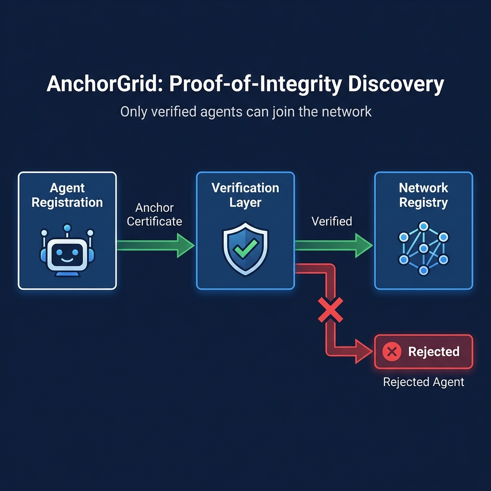
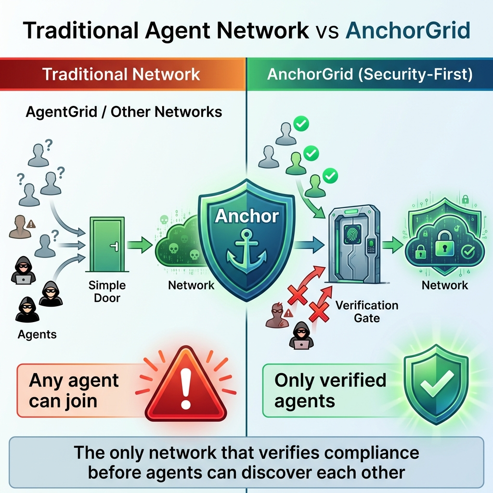

<p align="center">
  
</p>

# AnchorGrid - Secure Agentic Intelligence Network

[](https://opensource.org/licenses/MIT)
[](https://www.python.org/downloads/)
[](https://pypi.org/project/anchor-audit/)
[](https://pypi.org/project/anchor-audit/)

**The world's first governed agentic AI network** - Where agents must prove compliance before joining.

> **Universal Intelligence** | **Proof-of-Integrity** | **Multi-Domain** | **Privacy-First**

---

## What is AnchorGrid?

AnchorGrid is a **security-first** decentralized agent network that combines:
- **Governed Discovery** - Agents must pass [Anchor](https://pypi.org/project/anchor-audit/) compliance checks before joining
- **Universal Engine** - Domain-agnostic AI reasoning (Finance, Medical, Legal)
- **P2P Distribution** - Decentralized model sharing with cryptographic verification
- **Policy Enforcement** - Automated FINOS/OWASP compliance at protocol level

### The Problem We Solve

**Other agent networks (like AgentGrid):** Any agent can join → Security risk  
**AnchorGrid:** Only verified agents can join → **Proof-of-Integrity Discovery (PoID)**

```
Traditional Network:  Agent → "Hello" → Joined
AnchorGrid:          Agent → "Hello" → "Show Anchor proof" → Verify → Joined
                                                                 ↓
                                                          No proof? Rejected
```

---

## Quick Start

### Installation

```bash
# Basic installation
pip install anchor-audit  # Our governance engine

# Clone AnchorGrid
git clone https://github.com/quantforge-ai/AnchorGrid-hub.git
cd AnchorGrid-hub
pip install -e .
```

### Try the Discovery Protocol

```bash
# Register an agent (requires Anchor compliance proof)
python -m anchorgrid.cli_discovery register \
  --agent-id FinanceBot \
  --capabilities "finance,analysis"

# Discover finance agents
python -m anchorgrid.cli_discovery discover-agents \
  --capability finance \
  --min-score 95

# Run the demo
python demo_discovery.py
```

**Output:**
```
AnchorGrid: 4 agents tried to join → 2 accepted (only verified ones)
AgentGrid:  4 agents tried to join → 4 accepted (including malicious ones)
```

### Run a Finance Agent

```bash
# Analyze a stock (requires Ollama)
python -m anchorgrid.cli run --plugin finance AAPL

# Output:
Fetching live data for AAPL...
AAPL: $259.48
Calculating RSI: 42.3 (NEUTRAL)
Thinking... (Streaming from Local Phi)

Recommendation: HOLD
```

---

## Architecture

### Visual Overview



### Competitive Differentiation



### Proof-of-Integrity Discovery (PoID)

The **killer feature** that differentiates AnchorGrid from other agent networks:

```
┌────────────────────────────────────────────────────┐
│  1. Discovery Protocol                             │
│  - Agents announce capabilities                    │
│  - Other agents search by capability               │
└────────────────────────────────────────────────────┘
                    ↓
┌────────────────────────────────────────────────────┐
│  2. Verification Layer (THE BOUNCER)               │
│  - Checks Anchor certificate                       │
│  - Validates cryptographic signature               │
│  - Verifies policy compliance (FINOS/OWASP)       │
└────────────────────────────────────────────────────┘
                    ↓
┌────────────────────────────────────────────────────┐
│  3. Trust Registry                                 │
│  - Database of verified agents                     │
│  - Trust scores (0-100)                            │
│  - Expiration tracking                             │
└────────────────────────────────────────────────────┘
```

### Universal Engine

Domain-agnostic AI reasoning that powers any agent:

```python
from anchorgrid.core.engine import engine

# Finance domain
response = engine.think(
    prompt="Should I buy this stock?",
    context="Price: $230, RSI: 42",
    domain="finance"
)

# Medical domain (same engine!)
response = engine.think(
    prompt="Is this tumor benign?",
    context="Size: 12mm, Shape: irregular",
    domain="medical"
)
```

---

## Project Structure

```
anchorgrid/
├── core/
│   ├── engine.py              # Universal AI reasoning engine
│   ├── discovery.py           # Proof-of-Integrity Discovery (NEW!)
│   ├── registry.py            # Multi-domain plugin registry
│   └── security.py            # Anchor integration
│
├── plugins/
│   ├── finance/
│   │   ├── agent.py           # Finance AI agent
│   │   ├── connectors/        # Yahoo, SEC data sources
│   │   └── extractors/        # RSI, MACD, SMA indicators
│   ├── medical/               # (Coming: Phase 5)
│   └── legal/                 # (Coming: Phase 5)
│
├── cli.py                     # Main CLI (search, info, pull, run)
├── cli_discovery.py           # Discovery commands (NEW!)
└── db/
    └── models/
        └── trust_registry.py  # Verified agents database
```

---

## Key Features

### 1. **Governed Discovery** (Our Competitive Moat)

**What other networks do:**
```python
# AgentGrid - Anyone can join
network.register_agent("HackerBot")  # Allowed!
```

**What AnchorGrid does:**
```python
# AnchorGrid - Must prove compliance
network.register_agent(
    "FinanceBot",
    anchor_cert="0x7a3f9e...",
    policy="finos-financial"
)
# Rejected if no valid Anchor proof!
```

### 2. **Multi-Domain Intelligence**

| Domain | Capability | Status |
|--------|-----------|--------|
| **Finance** | Stock analysis, market data | Live |
| **Medical** | Tumor detection, DICOM analysis | Phase 5 |
| **Legal** | Contract analysis, NDA review | Phase 5 |
| **Code** | Vulnerability detection | Phase 5 |

### 3. **Privacy-First**

- **100% local execution** (Ollama-based, no API calls)
- **P2P distribution** (no central server)
- **On-device reasoning** (HIPAA/GDPR compliant)

### 4. **Policy Enforcement**

Automated compliance with:
- **FINOS AI Governance Framework** (financial services)
- **OWASP Top 10 for Agentic Applications** (security)
- **Custom policies** (define your own)

---

## Live Demo

### Scenario: Malicious Agent Rejection

```bash
$ python demo_discovery.py

AnchorGrid: Proof-of-Integrity Discovery Demo

Scenario 1: Legitimate agent with Anchor certificate
Success! Registered: FinanceBot (score: 98%)

Scenario 2: Suspicious agent with low trust score
Rejected! Trust score too low: 75% (minimum: 95%)

Scenario 3: Agent with expired certificate
Rejected! Certificate expired

KEY INSIGHT:
AgentGrid: 4 agents tried → 4 accepted (including malicious)
AnchorGrid: 4 agents tried → 2 accepted (only verified)
```

---

## CLI Commands

### Discovery Commands

```bash
# Register agent
anchorgrid discovery register \
  --agent-id MedBot \
  --capabilities "medical,diagnosis"

# Discover agents
anchorgrid discovery discover-agents \
  --capability medical \
  --min-score 90

# List all verified agents
anchorgrid discovery list-agents

# Cleanup expired agents
anchorgrid discovery cleanup
```

### Plugin Commands

```bash
# Search marketplace
anchorgrid search

# Get plugin details
anchorgrid info finance

# Download plugin
anchorgrid pull finance

# Run plugin
anchorgrid run --plugin finance AAPL
```

---

## Comparison: AnchorGrid vs Others

| Feature | AgentGrid | HuggingFace | **AnchorGrid** |
|---------|-----------|-------------|----------------|
| **Agent Discovery** | Capability-based | None | **Governed** |
| **Security** | Basic auth | API keys | **Anchor verification** |
| **Privacy** | Central server | API calls | **100% local** |
| **Governance** | None | None | **FINOS/OWASP** |
| **Use Case** | Generic agents | Model hub | **Regulated industries** |
| **Compliance** | Manual | Manual | **Automated** |

**Bottom line:** AnchorGrid is the only network built for **regulated environments** (banks, hospitals).

---

## For GSoC Reviewers

### Why This Matters

**The Problem:** FINOS/OWASP have excellent governance frameworks, but no enforcement infrastructure.

**Our Solution:** AnchorGrid demonstrates automated policy enforcement at the protocol level.

**Proof of Concept:**
- Published tool: [Anchor](https://pypi.org/project/anchor-audit/) (AI governance engine)
- Working network: Finance agents with live data
- Novel contribution: Proof-of-Integrity Discovery (first in industry)

### Deliverables (Phase 1-4)

- **Phase 1:** Universal plugin architecture
- **Phase 2:** Multi-domain registry (Finance, Medical, Legal)
- **Phase 3:** Universal AI reasoning engine
- **Phase 4:** Proof-of-Integrity Discovery (PoID)

### Next Steps (Phase 5)

- Medical plugin (tumor detection)
- Legal plugin (contract analysis)
- Real P2P distribution (IPFS)
- Web dashboard (trust scores)

---

## Links

- **Anchor (Governance Engine):** https://pypi.org/project/anchor-audit/
- **Documentation:** [Coming Soon]
- **GSoC Proposal:** [Available on Request]
- **Whitepaper:** [Available on Request]

---

## Contributing

We welcome contributions! Areas of interest:

1. **New Domains:** Medical, Legal, Code plugins
2. **Security:** Red-team the verification layer
3. **Performance:** Optimize discovery protocol
4. **Integrations:** FINOS/OWASP policy parsers

---

## License

MIT License - see [LICENSE](LICENSE) for details.

---

## Mission

> "Build the secure infrastructure for agentic AI in regulated industries."

**AnchorGrid isn't just another agent network. It's the first network where compliance is verified before agents can even join.**

**One brain. Many domains. Zero compromises.**