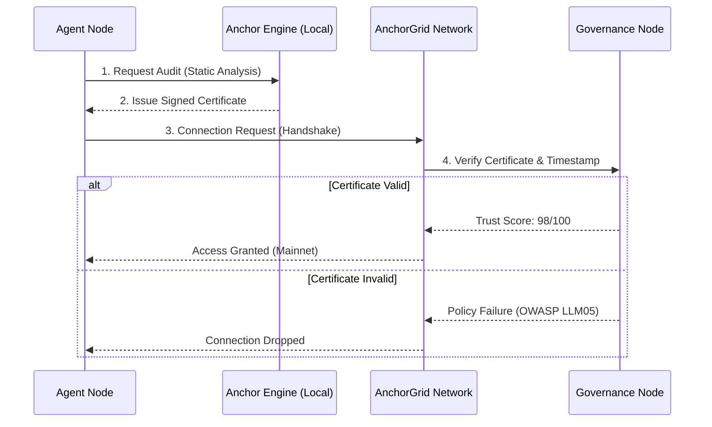

# AnchorGrid-Hub: The Secure Agent Economy

<div align="center">
  
  
  <h3>
    <b>Discover, verify, and deploy autonomous agents.</b><br>
    Protected by the <a href="https://pypi.org/project/anchor-audit/">Proof-of-Integrity Protocol</a>.
  </h3>
</div>

---

## What is AnchorGrid?

AnchorGrid is the **first decentralized agent network** that enforces security at the protocol level.

Unlike standard networks where "any agent can join," AnchorGrid uses a **Proof-of-Integrity handshake**. Agents must cryptographically prove they comply with OWASP & FINOS policies before they are allowed to discover peers.

> **"The Bouncer for AI Agents."** — If you don't have a valid Audit Certificate, you don't get in.

---

## The Network (Live Preview) 📸

The **AnchorGrid Hub** visualizes the real-time "Trust Scores" of agents on the network.


- **Green Shield:** Agent passed `anchor-audit` (Safe to run).
- **Red Shield:** Agent failed policy checks (Blocked at protocol level).

---

## Quick Start

### 1. Installation

The governance engine is available on PyPI. The Hub (this repo) is the reference implementation.

```bash
# Install the Security Engine (Published)
pip install anchor-audit

# Clone the Network Node
git clone https://github.com/quantforge-ai/AnchorGrid-hub.git
cd AnchorGrid-hub
pip install -e .
```

### 2. Run the Discovery Protocol

Try to register a "Malicious" agent and watch the protocol reject it.

```bash
# Step 1: Initialize the Node
python -m anchorgrid.node start --port 8000

# Step 2: Try to register an unverified agent
# Result: REJECTED (Error: Missing Proof-of-Integrity Certificate)
python demo_discovery.py --agent "EvilBot" --no-cert

# Step 3: Register a verified agent
# Result: ACCEPTED (Trust Score: 98/100)
python demo_discovery.py --agent "FinanceBot" --cert-path ./certs/valid.pem
```

---

## Competitive Differentiation

Why AnchorGrid is necessary for the **Agentic Security Initiative**:

| Feature | Standard Agent Networks | AnchorGrid (This Project) |
|---------|---------------------------|----------------------------|
| **Entry Barrier** | None (Anyone can join) | **Strict (Proof-of-Integrity Required)** |
| **Security Model** | "User Beware" | **"Verify Then Trust"** |
| **Enforcement** | Manual Code Review | **Automated Cryptographic Proofs** |
| **Policy Standard** | N/A | **OWASP Top 10 (LLM02, LLM05)** |
| **Discovery** | Public List | **Governed DHT** |

---

## Architecture: The Governance Handshake

The core innovation is the **Proof-of-Integrity Discovery (PoID)** protocol. Unlike standard DHTs, AnchorGrid inserts a verification layer before any peer connection is established.

<br/>



---

## Roadmap (GSoC 2026)

This repository serves as the **Reference Implementation** for my GSoC proposal.

- [x] **Phase 1:** The Engine (`anchor-audit` on PyPI) (Completed)
- [x] **Phase 2:** The Core (Basic P2P Discovery) (Completed)
- [ ] **Phase 3:** The Hub (Next.js Dashboard - In Progress)
- [ ] **Phase 4:** Medical Plugins (HIPAA-compliant Agent Templates) (Upcoming)
- [ ] **Phase 5:** Mainnet (Public DHT Launch) (Upcoming)

---

## Contributing

We are actively looking for contributors to help build:

- **Connectors:** Integrations for LangChain and AutoGPT.
- **Policies:** New RuleSets for `anchor-audit` (e.g., GDPR, SOC2).

---

## License

**License:** Apache 2.0  
**Maintained by:** Tanishq Dasari

---

## Links

- **Published Tool:** [anchor-audit on PyPI](https://pypi.org/project/anchor-audit/)
- **GitHub:** [AnchorGrid-hub](https://github.com/quantforge-ai/AnchorGrid-hub)
- **GSoC 2026:** [Proposal Available on Request]